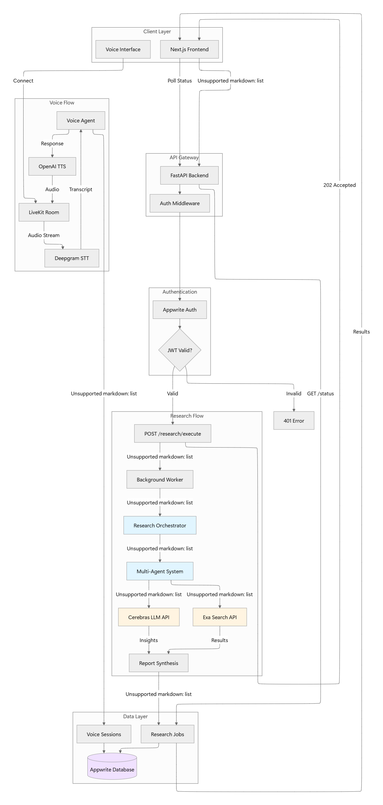
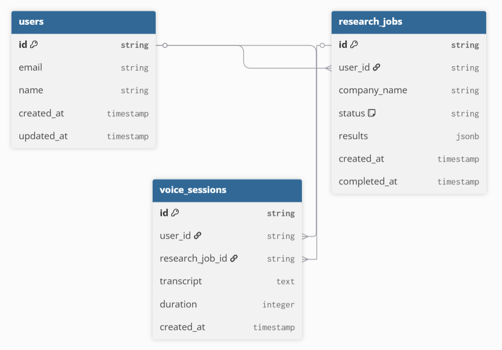

# Clariq

## Overview

Clariq is your AI-powered sales research partner that delivers clear, actionable insights on prospects, markets, and opportunities—helping you close smarter, faster, and with confidence. It automates data collection, synthesizes findings using state-of-the-art AI, and turns them into concise, decision-ready briefs. Use it from the web app or programmatically via the API to trigger research jobs, track progress, and retrieve structured results.

### Key Features

- Research jobs with async orchestration: queue execution, poll status, and fetch results via a clean REST API
- Multi-source data collection with Exa search integration
- AI summarization and report generation powered by Cerebras models and prompt templates
- Voice-enabled workflows using LiveKit for real-time transcription and interactive sessions
- Secure authentication with Appwrite session JWTs
- Modern, scalable stack: FastAPI backend, Next.js frontend, cloud-ready deployment

## [LIVE LINK 🌱](https://clariq-agent.vercel.app) | [YOUTUBE DEMO 🎥](https://youtu.be/91btHWszARs)

## Tech Stack

### Backend

- **Framework:** FastAPI, Python, Uvicorn
- **Database:** Appwrite (JWT auth, collections)
- **AI/LLM:** Cerebras Cloud SDK (`llama-4-scout-17b-16e-instruct`)
- **Search:** Exa API (neural search, company discovery)
- **Voice:** LiveKit Agents (Deepgram, Silero VAD, OpenAI TTS)

### Frontend

- **Framework:** Next.js 15, React, TypeScript
- **Styling:** Tailwind CSS, shadcn/ui
- **Auth:** Appwrite Client SDK
- **Real-time:** LiveKit Client SDK

## DATAFLOW DIAGRAM

## API

### Backend API Endpoints

| Method | Endpoint                        | Description                        | Auth | Response     |
| ------ | ------------------------------- | ---------------------------------- | ---- | ------------ |
| `GET`  | `/health`                       | Liveness/readiness probe           | ❌   | 200 OK       |
| `GET`  | `/`                             | Root message                       | ❌   | 200 OK       |
| `GET`  | `/v1/auth/test-connection`      | Public connectivity check          | ❌   | 200 OK       |
| `GET`  | `/v1/auth/me`                   | Get current authenticated user     | ✅   | 200 OK       |
| `POST` | `/v1/research/execute/{job_id}` | Queue execution for a research job | ✅   | 202 Accepted |
| `GET`  | `/v1/research/status/{job_id}`  | Get status for a research job      | ✅   | 200 OK       |
| `GET`  | `/v1/research/health`           | Research service health check      | ❌   | 200 OK       |

> **Note:** Base URLs: Local `http://localhost:8000` | Production `https://api.clariq.app`  
> All endpoints prefixed with `/v1` except root and health. Authentication via Appwrite JWT: `Authorization: Bearer <token>`

### Frontend Routes

| Route                 | Description                        | Auth |
| --------------------- | ---------------------------------- | ---- |
| `/`                   | Landing page with features and CTA | ❌   |
| `/signin`             | Authentication page                | ❌   |
| `/dashboard`          | Main dashboard                     | ✅   |
| `/dashboard/research` | Research jobs interface            | ✅   |
| `/dashboard/voice`    | Voice session interface            | ✅   |
| `/test-auth`          | Authentication testing page        | ✅   |

> **Note:** Deployed at [https://clariq-agent.vercel.app](https://clariq-agent.vercel.app)

## DATABASE SCHEMA

## Future Scope

### AI-Powered Voice Agent (In Development)

Currently, the voice agent feature is under development. We are building an intelligent conversational AI system that will:

- **Research-Driven Conversations**: Create public voice rooms where AI agents can interact with clients based on completed research data
- **Context-Aware Discussions**: The agent will leverage research insights (company profiles, market analysis, competitor data) to have informed, personalized sales conversations
- **RAG Integration**: All voice conversations will be transcribed in real-time and stored in a Retrieval-Augmented Generation (RAG) system
- **Continuous Learning**: Transcripts feed into the context database, allowing the LLM to learn from previous interactions and improve responses over time
- **Session History**: Users can review past conversations, extract key talking points, and track engagement metrics

**Technical Implementation:**

- LiveKit for real-time audio streaming
- Deepgram for speech-to-text transcription
- Vector database for conversation embeddings
- Cerebras LLM for context-aware response generation
- OpenAI TTS for natural voice synthesis

This feature will enable sales teams to have AI agents conduct preliminary discovery calls, answer client questions, and gather insights autonomously while maintaining conversation quality and context throughout multiple sessions.

---

**Development:** See `backend/README.md` and `client/README.md` for setup instructions.

## Thank You

---

Built with ❤️ by the Clariq Team
