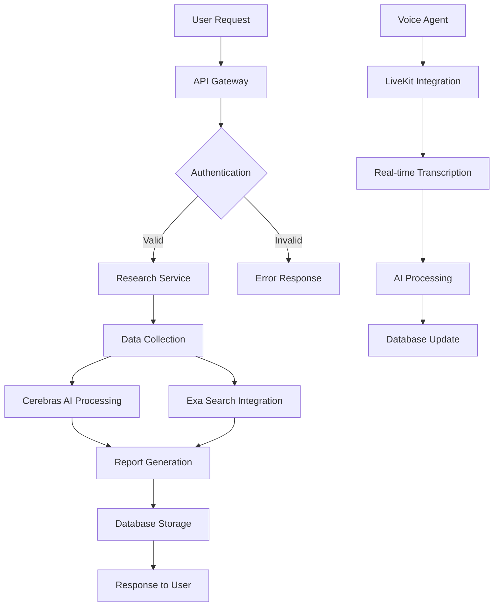

# Clariq

## Overview

Clariq is your AI-powered sales research partner that delivers clear, actionable insights on prospects, markets, and opportunities—helping you close smarter, faster, and with confidence.

## LIVE LINK | YOUTUBE DEMO

- **Live Application:** [https://clariq.app](https://clariq.app)
- **YouTube Demo:** [Watch Demo](https://youtube.com/watch?v=demo)

## API

### Base URLs

- Local: `http://localhost:8000`
- Production: `https://api.clariq.app`

All API endpoints are prefixed with `/v1`.

### Authentication

Most endpoints require an Appwrite session JWT via the Authorization header:

```
Authorization: Bearer <appwrite_session_jwt>
```

Public routes (no auth required): `/`, `/health`, `/v1/auth/test-connection`, `/v1/research/health`.

### Endpoints

#### System

- `GET /health` — Liveness/readiness probe
- `GET /` — Root message

#### Authentication

- `GET /v1/auth/test-connection` — Public connectivity check
- `GET /v1/auth/me` — Get the current authenticated user

#### Research

- `POST /v1/research/execute/{job_id}` — Queue execution for a research job
- `GET /v1/research/status/{job_id}` — Get status for a research job

## DATABASE SCHEMA (DBML CODE)

```dbml
// Database schema for Clariq
// Users and authentication
Table users {
  id string [pk]
  email string [unique]
  name string
  created_at timestamp
  updated_at timestamp
}

// Research jobs
Table research_jobs {
  id string [pk]
  user_id string [ref: > users.id]
  company_name string
  status string [default: 'pending']
  results jsonb
  created_at timestamp
  completed_at timestamp
}

// Voice sessions
Table voice_sessions {
  id string [pk]
  user_id string [ref: > users.id]
  research_job_id string [ref: > research_jobs.id]
  transcript text
  duration integer
  created_at timestamp
}
```

## DATAFLOW DIAGRAM (mermaid code)



## Additional Info

### Tech Stack

- **Frontend:** Next.js, TypeScript, Tailwind CSS
- **Backend:** FastAPI, Python
- **Database:** Appwrite
- **AI Services:** Cerebras, Exa
- **Voice:** LiveKit

### Architecture

- **Microservices:** Modular backend services
- **Real-time:** WebSocket connections for voice features
- **Scalable:** Cloud-native deployment ready

### Development

- **Backend Setup:** See `backend/README.md`
- **Frontend Setup:** See `client/README.md`
- **Environment:** See `backend/.env.example` and `client/.env.local.example`

### Deployment

- **Frontend:** Vercel/Netlify
- **Backend:** Railway/Render
- **Database:** Appwrite Cloud
